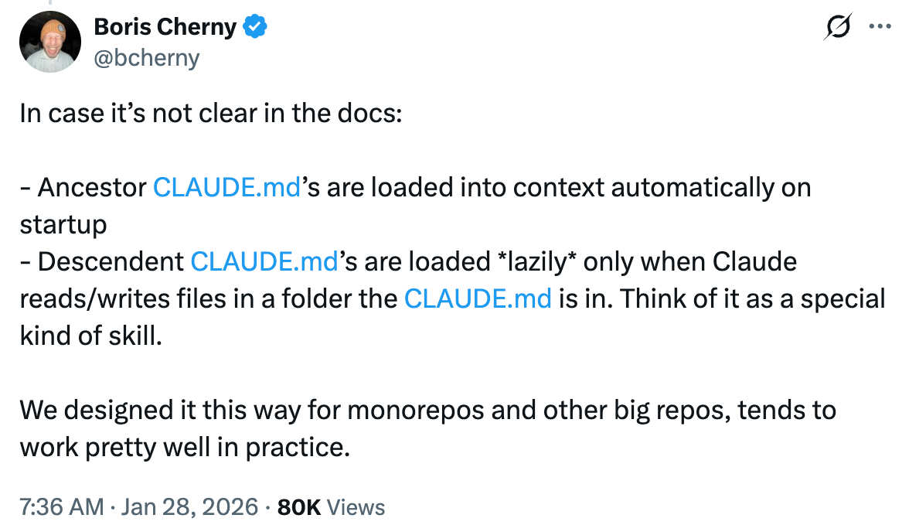

# Claude 记忆

通过 CLAUDE.md 文件实现持久化上下文 — 如何编写以及在 monorepo 中如何加载。

<table width="100%">
<tr>
<td><a href="../">← 返回 Claude Code 最佳实践</a></td>
<td align="right"></td>
</tr>
</table>

---

## 1. 编写良好的 CLAUDE.md

结构良好的 CLAUDE.md 是提升 Claude Code 项目输出效果的最重要方式。Humanlayer 有一份出色的指南，涵盖要包含的内容、如何组织以及常见陷阱。

- [Humanlayer - 编写良好的 Claude.md](https://www.humanlayer.dev/blog/writing-a-good-claude-md)

---

## 2. 大型 Monorepo 中的 CLAUDE.md

在 monorepo 中使用 Claude Code 时，了解 CLAUDE.md 文件如何加载到上下文中对于有效组织项目指令至关重要。

<p align="center">
  <a href="https://x.com/bcherny/status/2016339448863355206"></a>
</p>

### 两种加载机制

Claude Code 使用两种不同的机制来加载 CLAUDE.md 文件：

#### 祖先加载（向上）

当你启动 Claude Code 时，它会从当前工作目录**向上**遍历到文件系统根目录，并加载沿途找到的每个 CLAUDE.md。这些文件在**启动时立即加载**。

#### 后代加载（向下）

当前工作目录子目录中的 CLAUDE.md 文件在启动时**不会加载**。只有在会话期间 Claude 读取这些子目录中的文件时才会包含它们。这被称为**延迟加载**。

### 示例 Monorepo 结构

考虑一个典型的 monorepo，不同组件有单独的目录：

```
/mymonorepo/
├── CLAUDE.md          # 根级指令（所有组件共享）
├── frontend/
│   └── CLAUDE.md      # 前端特定指令
├── backend/
│   └── CLAUDE.md      # 后端特定指令
└── api/
    └── CLAUDE.md      # API 特定指令
```

### 场景 1：从根目录运行 Claude Code

当你在 `/mymonorepo/` 运行 Claude Code 时：

```bash
cd /mymonorepo
claude
```

| 文件 | 启动时加载？ | 原因 |
|------|-------------------|--------|
| `/mymonorepo/CLAUDE.md` | 是 | 你的当前工作目录 |
| `/mymonorepo/frontend/CLAUDE.md` | 否 | 仅在你读取/编辑 `frontend/` 中的文件时加载 |
| `/mymonorepo/backend/CLAUDE.md` | 否 | 仅在你读取/编辑 `backend/` 中的文件时加载 |
| `/mymonorepo/api/CLAUDE.md` | 否 | 仅在你读取/编辑 `api/` 中的文件时加载 |

### 场景 2：从组件目录运行 Claude Code

当你在 `/mymonorepo/frontend/` 运行 Claude Code 时：

```bash
cd /mymonorepo/frontend
claude
```

| 文件 | 启动时加载？ | 原因 |
|------|-------------------|--------|
| `/mymonorepo/CLAUDE.md` | 是 | 祖先目录 |
| `/mymonorepo/frontend/CLAUDE.md` | 是 | 你的当前工作目录 |
| `/mymonorepo/backend/CLAUDE.md` | 否 | 目录树的不同分支 |
| `/mymonorepo/api/CLAUDE.md` | 否 | 目录树的不同分支 |

### 关键要点

1. **祖先总是在启动时加载** — Claude 向上遍历目录树并加载所有找到的 CLAUDE.md 文件。这确保你始终可以访问根级、整个仓库的指令。

2. **后代延迟加载** — 子目录的 CLAUDE.md 文件仅在你在这些子目录中交互文件时加载。这防止无关的上下文使你的会话膨胀。

3. **兄弟目录从不加载** — 如果你在 `frontend/` 中工作，`backend/CLAUDE.md` 或 `api/CLAUDE.md` 不会被加载到上下文中。

4. **全局 CLAUDE.md** — 你还可以在主目录的 `~/.claude/CLAUDE.md` 放置一个 CLAUDE.md，它适用于所有 Claude Code 会话，无论项目如何。

### 为什么这种设计适合 Monorepo

- **共享指令向下传播** — 根级 CLAUDE.md 包含适用于所有地方的仓库级约定、编码标准和常见模式。

- **组件特定指令保持隔离** — 前端开发者不需要后端特定指令来污染他们的上下文，反之亦然。

- **上下文优化** — 通过延迟加载后代 CLAUDE.md 文件，Claude Code 避免在启动时加载可能数百千字节的无关指令。

### 最佳实践

1. **将共享约定放在根 CLAUDE.md 中** — 编码标准、提交信息格式、PR 模板和其他仓库级指南。

2. **将组件特定指令放在组件 CLAUDE.md 中** — 该组件特有的框架特定模式、组件架构、测试约定。

3. **使用 CLAUDE.local.md 存放个人偏好** — 将其添加到 `.gitignore` 以存放不应与团队共享的指令。

---

## 参考资料

- [Claude Code 文档 - Claude 如何查找记忆](https://code.claude.com/docs/en/memory#how-claude-looks-up-memories)
- [Boris Cherny 关于 X - CLAUDE.md 加载说明](https://x.com/bcherny/status/2016339448863355206)
- [Humanlayer - 编写良好的 Claude.md](https://www.humanlayer.dev/blog/writing-a-good-claude-md)