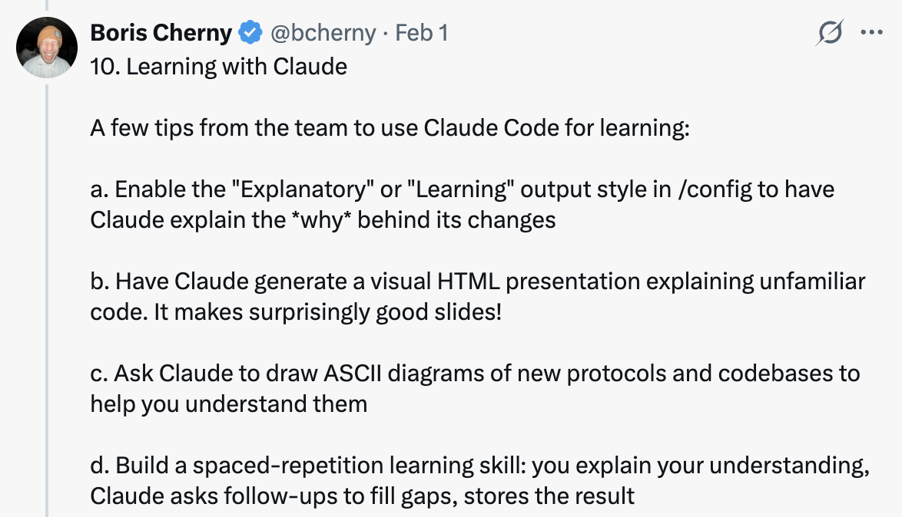

# 使用 Claude Code 的 10 个技巧 — 来自 Claude Code 团队

Boris Cherny（[@bcherny](https://x.com/bcherny)），Claude Code 的 creator，于 2026 年 2 月 1 日分享的团队技巧摘要。

<table width="100%">
<tr>
<td><a href="../">← 返回 Claude Code 最佳实践</a></td>
<td align="right"></td>
</tr>
</table>

---

## 背景

Boris 分享了直接来自 Claude Code 团队的使用技巧。团队使用 Claude 的方式与 Boris 个人使用的方式不同。请记住：使用 Claude Code 没有唯一正确的方式 — 每个人的设置都不同。你应该尝试找出最适合你的方式！

---

## 1/ 并行做更多事情

同时启动 3-5 个 git worktree，每个都在并行运行自己的 Claude 会话。这是最大的生产力提升，也是团队的首要技巧。就个人而言，Boris 使用多个 git checkout，但大多数 Claude Code 团队成员更喜欢 worktree — 这也是为什么 @amorisscode 在 Claude Desktop 应用中内置了原生支持的原因！

有些人还会给他们的 worktree 命名并设置 shell 别名（`2a`、`2b`、`2c`），这样他们可以一键在之间切换。其他人有一个专门的"分析" worktree，仅用于读取日志和运行 BigQuery。

参见：[Worktrees 文档](https://code.claude.com/docs/en/common...)

---

## 2/ 每个复杂任务都从计划模式开始

把你的精力投入到计划中，这样 Claude 就可以一次完成实现。

有一个人让一个 Claude 写计划，然后启动第二个 Claude 以高级工程师的身份审查它。

另一个人说，一旦事情出错，他们就切换回计划模式并重新规划。不要继续硬推。他们还明确告诉 Claude 在验证步骤时进入计划模式，而不仅仅是在构建时。

---

## 3/ 投资你的 CLAUDE.md

每次纠正后，以这样的话结束："更新你的 CLAUDE.md，这样你就不会再犯那个错误了。"Claude 非常擅长为自己写规则。

无情地编辑你的 `CLAUDE.md`。不断迭代，直到 Claude 的错误率明显下降。

一位工程师告诉 Claude 为每个任务/项目维护一个 notes 目录，在每个 PR 之后更新。然后他们让 `CLAUDE.md` 指向它。

---

## 4/ 创建你自己的技能并提交到 Git

在每个项目中复用。团队技巧：

- 如果你一天做某事超过一次，把它变成一个技能或命令
- 构建一个 `/techdebt` 斜杠命令，在每个会话结束时运行它来查找和删除重复代码
- 设置一个斜杠命令，同步 7 天的 Slack、GDrive、Asana 和 GitHub 到一个上下文转储
- 构建类似数据分析工程师的 agent，来编写 dbt 模型、审查代码和在开发环境中测试更改

参见：[使用技能扩展 Claude — Claude Code 文档](https://code.claude.com/docs/en/skills)

---

## 5/ Claude 能自己修复大多数 Bug

团队是这样做的：

启用 Slack MCP，然后粘贴一个 Slack bug 讨论串到 Claude 里，只需说"fix"。无需切换上下文。

或者说："去修复失败的 CI 测试。"不要微观管理怎么做。

让 Claude 指向 docker 日志来排查分布式系统 — 出人意料地擅长这个。

---

## 6/ 提升你的提示技巧

a. **挑战 Claude。** 说"对这些更改进行严格审查，在我通过你的测试之前不要创建 PR。"让 Claude 成为你的审查者。或者说"向我证明这有效"并让 Claude 比较 main 和特性分支之间的行为。

b. **在一次平庸的修复后，** 说："以你现在的全部认知，放弃这个，实现优雅的解决方案。"

c. **编写详细的规格** 并在交接工作前减少歧义。你越具体，输出越好。

---

## 7/ 终端与环境设置

团队喜欢 Ghostty！多人喜欢它的同步渲染、24 位色彩和正确的 unicode 支持。

为了更轻松地管理多个 Claude，使用 `/statusline` 自定义你的状态栏，始终显示上下文使用情况和当前 git 分支。许多人也给他们的终端标签着色和命名，有时使用 tmux — 每个任务/worktree 一个标签。

使用语音输入。你说话的速度是打字速度的 3 倍，结果你的提示会详细得多。（在 macOS 上连按 fn 两次）

参见：[终端设置文档](https://code.claude.com/docs/en/termin...)

---

## 8/ 使用 Subagent

a. 在任何你希望 Claude 投入更多计算力的问题上，追加"use subagents"。

b. 将单个任务卸载给 subagent，以保持你的主 agent 的上下文窗口干净和专注。

c. 通过 hook 将权限请求路由到 Opus 4.5 — 让它扫描攻击并自动批准安全的请求。参见：[Hooks 文档](https://code.claude.com/docs/en/hooks#...)

---

## 9/ 使用 Claude 进行数据分析

让 Claude Code 使用 "bq" CLI 来即时拉取和分析指标。团队有一个 BigQuery 技能检入代码库，每个人都直接在 Claude Code 中使用它进行数据分析查询。就个人而言，Boris 已经 6 个多月没写一行 SQL 了。

这适用于任何有 CLI、MCP 或 API 的数据库。

---

## 10/ 与 Claude 一起学习

团队使用 Claude Code 学习的一些技巧：

a. 在 `/config` 中启用"解释性"或"学习"输出风格，让 Claude 解释其更改背后的"为什么"。

b. 让 Claude 生成一个可视化的 HTML 演示来解释不熟悉的代码。它能做出非常棒的幻灯片！

c. 让 Claude 为新协议和代码库绘制 ASCII 图表来帮助你理解它们。

d. 构建一个间隔重复学习技能：你解释你的理解，Claude 提问后续问题来填补空白，存储结果。

---

## 来源

- [Boris Cherny (@bcherny) 在 X 上 — 2026 年 2 月 1 日](https://x.com/bcherny/status/2017742741636321619)