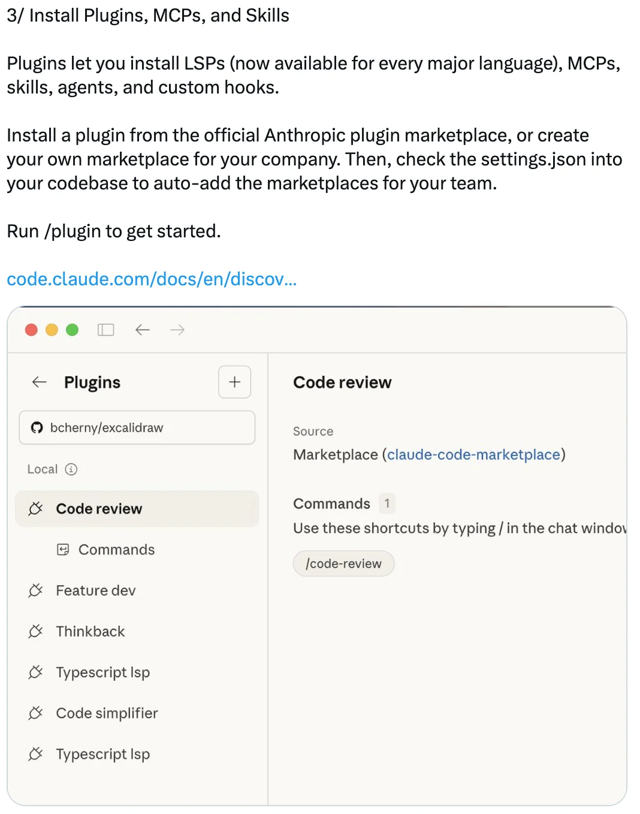
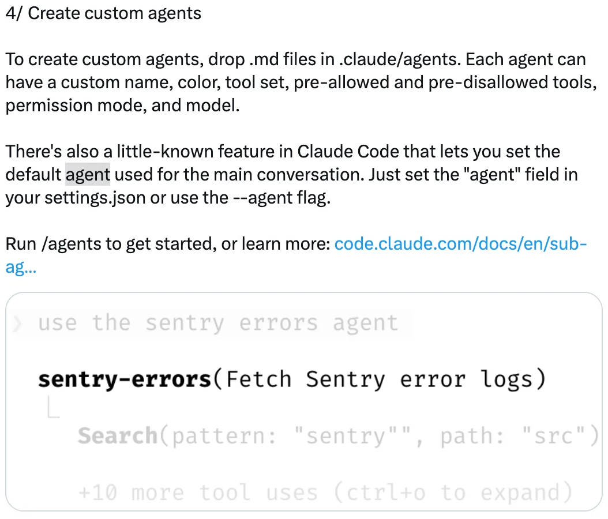

# 定制 Claude Code 的 12 种方式 — Boris Cherny 的技巧

Boris Cherny（[@bcherny](https://x.com/bcherny)），Claude Code 的 creator，于 2026 年 2 月 12 日分享的定制技巧摘要。

<table width="100%">
<tr>
<td><a href="../">← 返回 Claude Code 最佳实践</a></td>
<td align="right"></td>
</tr>
</table>

---

## 背景

Boris Cherny 强调，定制性是工程师们最喜欢 Claude Code 的特点之一 — hooks、插件、LSP、MCP、技能、effort、自定义 agent、状态栏、输出风格等等。他分享了开发者和团队定制其设置的 12 种实用方式。

---

## 1/ 配置你的终端

为获得最佳 Claude Code 体验配置你的终端：

- **主题**：运行 `/config` 设置浅色/深色模式
- **通知**：为 iTerm2 启用通知，或使用自定义通知 hook
- **换行**：如果在 IDE 终端、Apple Terminal、Warp 或 Alacritty 中使用 Claude Code，运行 `/terminal-setup` 以启用 shift+enter 换行（这样你不需要输入 `\`）
- **Vim 模式**：运行 `/vim`

---

## 2/ 调整努力级别

运行 `/model` 选择你喜欢的努力级别：

- **低** — 更少 token，响应更快
- **中等** — 平衡的行为
- **高** — 更多 token，更智能

Boris 的偏好：一切都是高。

---

## 3/ 安装插件、MCP 和技能

插件让你安装 LSP（可用于所有主要语言）、MCP、技能、agent 和自定义 hook。

从官方 Anthropic 插件市场安装，或为你的公司创建你自己的市场。将 `settings.json` 检入你的代码库以自动为你的团队添加市场。

运行 `/plugin` 开始。

---

## 4/ 创建自定义 Agent

在 `.claude/agents` 中放置 `.md` 文件来创建自定义 agent。每个 agent 可以有自定义名称、颜色、工具集、预允许和预禁止的工具、权限模式和模型。

你也可以在 `settings.json` 中使用 `"agent"` 字段或 `--agent` 标志为主对话设置默认 agent。

运行 `/agents` 开始。

---

## 5/ 预批准常见权限

Claude Code 使用结合了提示注入检测、静态分析、沙盒和人工监督的权限系统。

开箱即用，一小组安全命令是预批准的。要预批准更多，运行 `/permissions` 并添加到允许和阻止列表。将这些检入你团队的 `settings.json`。

支持完整的通配符语法 — 例如，`Bash(bun run *)` 或 `Edit(/docs/**)`。

---

## 6/ 启用沙盒

选择加入 Claude Code 的开源沙盒运行时，以提高安全性同时减少权限提示。

运行 `/sandbox` 启用它。沙盒在你的机器上运行，支持文件和网络隔离。

---

## 7/ 添加状态栏

自定义状态栏显示在编写器正下方，显示模型、目录、剩余上下文、成本以及你工作时想看到的任何其他内容。

每个团队成员可以有不同的状态栏。使用 `/statusline` 让 Claude 根据你的 `.bashrc`/`.zshrc` 生成一个。

---

## 8/ 自定义你的快捷键

Claude Code 中的每个键绑定都是可自定义的。运行 `/keybindings` 重新映射任何键。设置会热重载，所以你可以立即看到感受如何。

<a href="https://x.com/bcherny/status/2021700883873165435"></a

---

## 9/ 设置 Hook

Hook 让你确定性地钩入 Claude 的生命周期：

- 自动将权限请求路由到 Slack 或 Opus
- 当 Claude 到达一轮的末尾时提醒它继续（你甚至可以启动一个 agent 或使用提示来决定 Claude 是否应该继续）
- 预处理或后处理工具调用，例如添加你自己的日志

让 Claude 添加一个 hook 来开始。

---

## 10/ 自定义你的旋转动词

自定义你的旋转动词，用你自己的动词添加或替换默认列表。将 `settings.json` 检入源代码控制以与你的团队共享动词。

<a href="https://x.com/bcherny/status/2021701145023197516"></a

---

## 11/ 使用输出风格

运行 `/config` 并设置输出风格，让 Claude 以不同的语气或格式回应。

- **解释性** — 建议在熟悉新代码库时使用，让 Claude 解释框架和代码模式
- **学习** — 让 Claude 指导你进行代码更改
- **自定义** — 创建自定义输出风格来调整 Claude 的声音

<a href="https://x.com/bcherny/status/2021701379409273093"></a

---

## 12/ 定制所有东西！

Claude Code 开箱即用效果很好，但当你确实要定制时，将你的 `settings.json` 检入 git，这样你的团队也能受益。支持多个级别的配置：

- 针对你的代码库
- 针对子文件夹
- 只针对你自己
- 通过企业级策略

有 37 个设置和 84 个环境变量（使用 `settings.json` 中的 `"env"` 字段以避免包装脚本），很可能你想配置的任何行为都是可配置的。

<a href="https://x.com/bcherny/status/2021701636075458648"></a

---

## 来源

- [Boris Cherny (@bcherny) 在 X 上 — 2026 年 2 月 12 日](https://x.com/bcherny)
- [Claude Code 终端设置文档](https://code.claude.com/docs/en/terminal)
- [Claude Code 插件与发现文档](https://code.claude.com/docs/en/discover-plugins)
- [Claude Code Sub-agent 文档](https://code.claude.com/docs/en/sub-agents)
- [Claude Code 权限文档](https://code.claude.com/docs/en/permissions)
- [Claude Code 沙盒文档](https://code.claude.com/docs/en/sandbox)
- [Claude Code 状态栏文档](https://code.claude.com/docs/en/statusline)
- [Claude Code 键盘快捷键文档](https://code.claude.com/docs/en/keybindings)
- [Claude Code Hooks 参考](https://code.claude.com/docs/en/hooks)
- [Claude Code 输出风格文档](https://code.claude.com/docs/en/output-styles)
- [Claude Code 设置文档](https://code.claude.com/docs/en/settings)