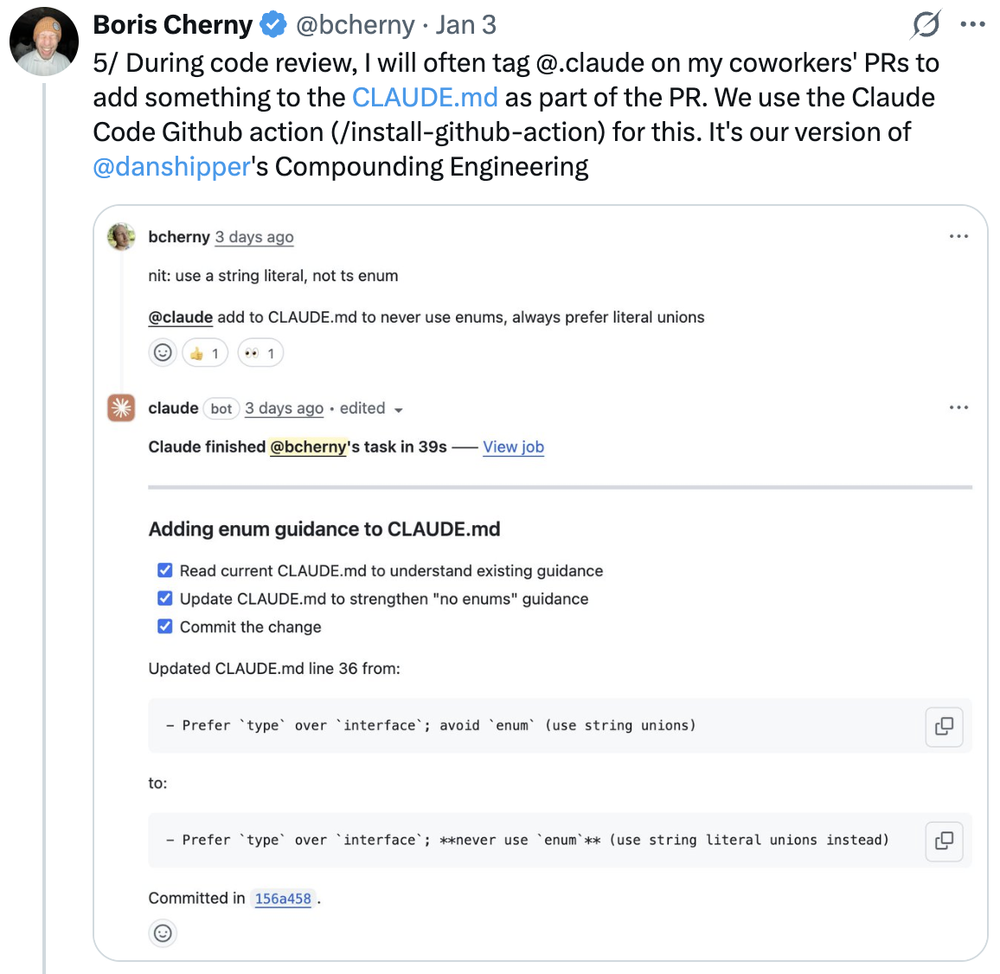
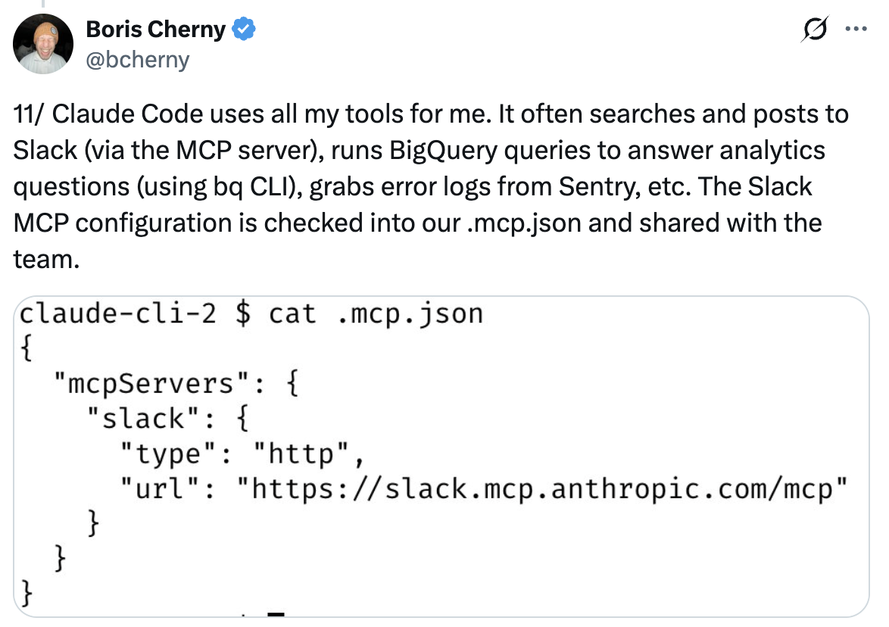

# 我如何使用 Claude Code — Boris Cherny 的 13 个技巧

Boris Cherny（[@bcherny](https://x.com/bcherny)），Claude Code 的 creator，于 2026 年 1 月 3 日分享的设置技巧摘要。

<table width="100%">
<tr>
<td><a href="../">← 返回 Claude Code 最佳实践</a></td>
<td align="right"></td>
</tr>
</table>

---

## 背景

Boris 分享了他个人的 Claude Code 设置，注意到它"出人意料地 vanilla" — Claude Code 开箱即用效果很好，所以他没有太多定制。使用它没有唯一正确的方式：团队有意构建它，让你能够按你喜欢的方式使用、定制和破解。Claude Code 团队中的每个人都使用它非常不同的方式。

<a href="https://x.com/bcherny/status/2007179832300581177"></a>

---

## 1/ 并行运行 5 个 Claude

在你的终端中并行运行 5 个 Claude。将你的标签编号为 1-5，并使用系统通知来知道何时某个 Claude 需要输入。

参见：[终端设置文档](https://code.claude.com/docs/en/terminal)

<a href="https://x.com/bcherny/status/2007179833990885678"></a>

---

## 2/ 使用 claude.ai/code 获得更多并行性

在 claude.ai/code 上并行运行 5-10 个 Claude，与你的本地 Claude 一起。使用 `claude.ai/code` 将本地会话交接给网页会话，在 Chrome 中手动启动会话，然后来回切换。

<a href="https://x.com/bcherny/status/2007179836704600237"></a

---

## 3/ 对所有事情使用带思考的 Opus

对所有事情使用 Opus 4.5 带思考。这是 Boris 使用过的最好的编码模型 — 尽管它比 Sonnet 更大更慢，但由于你更少需要引导它，而且它更擅长使用工具，最终几乎总是比使用更小的模型更快。

<a href="https://x.com/bcherny/status/2007179838864666847"></a

---

## 4/ 与你的团队共享一个 CLAUDE.md

为代码库共享一个 `CLAUDE.md`。将其检入 git，并让整个团队每周贡献多次。每当 Claude 做错了什么，就把它添加到 `CLAUDE.md`，这样 Claude 就知道下次不要这样做。

<a href="https://x.com/bcherny/status/2007179840848597422"></a

---

## 5/ 在 PR 上标记 @claude 来更新 CLAUDE.md

在代码审查期间，在同事的 PR 上标记 @claude，将一些内容作为 PR 的一部分添加到 `CLAUDE.md`。为此使用 Claude Code GitHub action（[@hub-action](https://github.com/apps/claude)）— 这是 Boris 的复合工程版本。

<a href="https://x.com/bcherny/status/2007179842928947333"></a

---

## 6/ 大多数会话从计划模式开始

大多数会话从计划模式开始（shift+tab 两次）。如果目标是写一个 Pull Request，使用计划模式与 Claude 来回交流，直到你满意它的计划。从那里切换到自动接受编辑模式，Claude 通常可以一次完成。一个好的计划真的非常重要。

<a href="https://x.com/bcherny/status/2007179845336527000"></a

---

## 7/ 使用斜杠命令进行内部循环工作流

对你每天做很多次的每个"内部循环"工作流使用斜杠命令。这节省了你重复提示的时间，也让 Claude 可以使用这些工作流。命令被检入 git，保存在 `.claude/commands/` 中。

示例：`/commit-push-pr` — 提交、推送并打开一个 PR。

<a href="https://x.com/bcherny/status/2007179847949500714"></a

---

## 8/ 使用 Subagent 自动化常见工作流

定期使用几个 subagent：`code-simplifier` 在 Claude 完成后简化代码，`verify-app` 有测试 Claude Code 端到端的详细说明，等等。把 subagent 看作是自动化最常见的工作流 — 类似于斜杠命令。

Subagent 保存在 `.claude/agents/` 中。

<a href="https://x.com/bcherny/status/2007179850139000872"></a

---

## 9/ 使用 PostToolUse Hook 自动格式化代码

使用 `PostToolUse` hook 来格式化 Claude 的代码。Claude 通常开箱即用生成格式良好的代码，而 hook 处理最后 10% 以避免以后在 CI 中出现格式错误。

```json
"PostToolUse": [
  {
    "matcher": "Write|Edit",
    "hooks": [
      {
        "type": "command",
        "command": "bun run format || true"
      }
    ]
  }
]
```

<a href="https://x.com/bcherny/status/2007179852047335529"></a

---

## 10/ 预允许权限而不是 --dangerously-skip-permissions

不要使用 `--dangerously-skip-permissions`。相反，使用 `/permissions` 来预允许你知道的在你的环境中安全的常见 bash 命令，以避免不必要的权限提示。大多数这些被检入 `.claude/settings.json` 并与团队共享。

<a href="https://x.com/bcherny/status/2007179854077407667"></a

---

## 11/ 让 Claude 通过 MCP 使用你的所有工具

Claude Code 使用你的所有工具。它经常搜索和发布到 Slack（通过 MCP 服务器），运行 BigQuery 查询来回答分析问题（使用 `bq` CLI），从 Sentry 获取错误日志，等等。Slack MCP 配置被检入 `.mcp.json` 并与团队共享。

<a href="https://x.com/bcherny/status/2007179856266789204"></a

---

## 12/ 用后台 Agent 验证长时间运行的任务

对于非常长时间运行的任务，要么 (a) 提示 Claude 在完成后用后台 agent 验证其工作，(b) 使用 agent Stop hook 更确定性地做到这一点，或 (c) 使用 ralph-wiggum 插件（最初由 @GeoffreyHuntley 构思）。

<a href="https://x.com/bcherny/status/2007179858435281082"></a

---

## 13/ 给 Claude 一种验证其工作的方法

获得 Claude Code 出色结果最重要的可能是 — 给 Claude 一种验证其工作的方法。如果 Claude 有这个反馈循环，它会将最终结果的质量提高 2-3 倍。

Boris 让 Claude 测试他提交的每一个更改。

<a href="https://x.com/bcherny/status/2007179861115511237"></a

---

## 来源

- [Boris Cherny (@bcherny) 在 X 上 — 2026 年 1 月 3 日](https://x.com/bcherny/status/2007179832300581177)