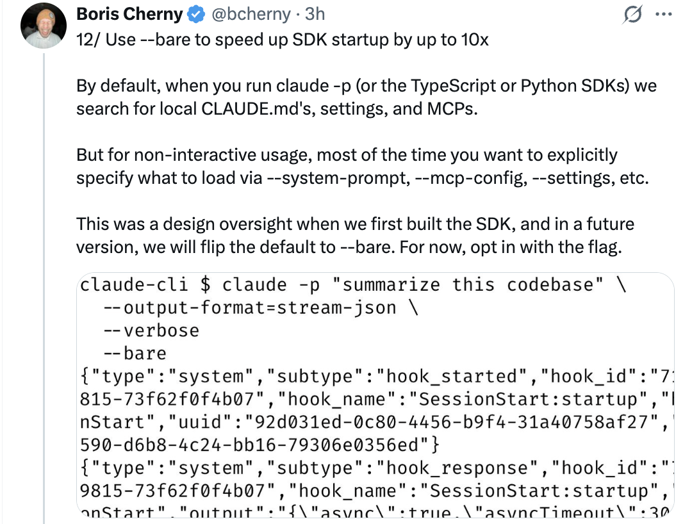
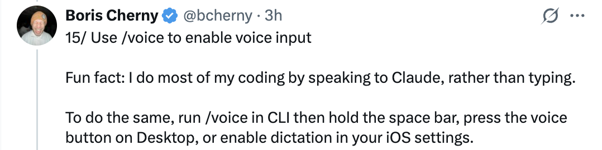

# Claude Code 的 15 个隐藏和未被充分利用的功能 — 来自 Boris Cherny

Boris Cherny（[@bcherny](https://x.com/bcherny)），Claude Code 的 creator，于 2026 年 3 月 30 日分享的技巧摘要。

<table width="100%">
<tr>
<td><a href="../">← 返回 Claude Code 最佳实践</a></td>
<td align="right"></td>
</tr>
</table>

---

## 背景

Boris 分享了他最喜欢的 Claude Code 中隐藏和未被充分利用的功能，重点是他使用最多的那些。

<a href="https://x.com/bcherny/status/2038454336355999749"></a

---

## 1/ Claude Code 有移动应用

你知道 Claude Code 有移动应用吗？Boris 在 iOS 应用上编写了很多代码 — 一种无需打开笔记本电脑即可进行更改的便捷方式。

- 为 iOS/Android 下载 Claude 应用
- 导航到左侧的 **Code** 标签
- 你可以直接在手机上审查更改、批准 PR 和编写代码

<a href="https://x.com/bcherny/status/2038454337811386436"></a

---

## 2/ 在移动/网页/桌面和终端之间移动会话

运行 `claude --teleport` 或 `/teleport` 以继续你机器上的云会话。或者运行 `/remote-control` 来控制本地运行的会话从你的手机。

- **Teleport**：将云会话拉到你的本地终端
- **Remote Control**：让你从任何设备控制本地会话
- Boris 在他的 `/config` 中设置了 **"Enable Remote Control for all sessions"**

<a href="https://x.com/bcherny/status/2038454339933548804"></a

---

## 3/ /loop 和 /schedule — 最强大的两个功能

使用这些来安排 Claude 自动运行，设定间隔最长一周。Boris 有很多循环在本地运行：

- `/loop 5m /babysit` — 自动处理代码审查、自动 rebase，并引导 PR 到生产
- `/loop 30m /slack-feedback` — 每 30 分钟自动将 PR 发布以获取 Slack 反馈
- `/loop /post-merge-sweeper` — 发布 PR 来处理他错过的代码审查评论
- `/loop 1h /pr-pruner` — 关闭过时和不再必要的 PR
- ……还有更多！

尝试将工作流转化为技能 + 循环。这很强大。

<a href="https://x.com/bcherny/status/2038454341884154269"></a

---

## 4/ 使用 Hook 确定性地运行逻辑

使用 hook 作为 agent 生命周期的一部分来运行逻辑。例如：

- 每次启动 Claude 时**动态加载**上下文（`SessionStart`）
- 记录模型运行的每个 bash 命令（`PreToolUse`）
- 将权限提示路由到 WhatsApp 让你批准/拒绝（`PermissionRequest`）
- 当 Claude 停止时**提醒它继续**（`Stop`）

<a href="https://x.com/bcherny/status/2038454343519932844"></a

---

## 5/ 同事 Dispatch

Boris 每天使用 Dispatch 来查看 Slack 和电子邮件、管理文件，以及当他不在电脑前时在笔记本上做事情。当他不编码时，他就在 dispatch。

- Dispatch 是 Claude Desktop 应用的**安全远程控制**
- 它可以使用你的 MCP、浏览器和计算机，经你允许
- 把它想象成从任何地方将非编码任务委托给 Claude 的方式

<a href="https://x.com/bcherny/status/2038454345419936040"></a

---

## 6/ 使用 Chrome 扩展进行前端工作

使用 Claude Code 最重要的技巧：**给 Claude 一种验证其输出的方法。**一旦你这样做，Claude 会迭代直到结果很棒。

- 想象成让某人构建一个网站，但不允许他们使用浏览器 — 结果可能不会好看
- 给 Claude 一个浏览器，它会编写代码并迭代直到看起来好看
- Boris 每次做网页代码时都使用 Chrome 扩展 — 它往往比其他类似的 MCP 更可靠

<a href="https://x.com/bcherny/status/2038454347156398333"></a

---

## 7/ 使用 Claude Desktop 应用自动启动和测试 Web 服务器

同样的，Desktop 应用内置了让 Claude **自动运行你的 Web 服务器，甚至在内置浏览器中测试它**的能力。

- 你可以在 CLI 或 VSCode 中使用 Chrome 扩展设置类似的功能
- 或者 just 使用 Desktop 应用获得集成体验

<a href="https://x.com/bcherny/status/2038454348804714642"></a

---

## 8/ 分支你的会话

人们经常问如何分支现有会话。有两种方式：

1. 从你的会话运行 `/branch`
2. 从 CLI，运行 `claude --resume <session-id> --fork-session`

`/branch` 创建一个分支的对话 — 你现在在分支中。要恢复原始的，使用 `claude -r <original-session-id>`。

<a href="https://x.com/bcherny/status/2038454350214041740"></a

---

## 9/ 使用 /btw 进行附带查询

Boris 经常用它来在 agent 工作时快速回答问题。`/btw` 让你在不中断 agent 当前任务的情况下提出附带问题。

示例：
```
/btw dachshund 怎么拼？
> dachshund — 德语"獾狗"（dachs + 獾，hund + 狗）。
↑/↓ 滚动 · Space、Enter 或 Escape 关闭
```

<a href="https://x.com/bcherny/status/2038454351849787485"></a

---

## 10/ 使用 Git Worktree

Claude Code 附带了对 git worktree 的深度支持。Worktree 对于在同一代码库中做大量并行工作至关重要。Boris 有**几十个 Claude 同时运行**，这就是他的做法。

- 使用 `claude -w` 在 worktree 中启动新会话
- 或者在 Claude Desktop 应用中勾选 **"worktree" 复选框**
- 对于非 git VCS 用户，使用 `WorktreeCreate` hook 来添加你自己的 worktree 创建逻辑

<a href="https://x.com/bcherny/status/2038454353787519164"></a

---

## 11/ 使用 /batch 大规模展开更改集

`/batch` 询问你，然后让 Claude 将工作展开到尽可能多的 **worktree agent**（数十、数百、甚至数千）来完成。

- 用于大型代码迁移和其他可并行化的工作
- 每个 worktree agent 独立在其自己的代码副本上工作

<a href="https://x.com/bcherny/status/2038454355469484142"></a

---

## 12/ 使用 --bare 将 SDK 启动速度提升高达 10 倍

默认情况下，当你运行 `claude -p`（或 TypeScript 或 Python SDK）时，Claude 会搜索本地的 CLAUDE.md、设置和 MCP。但对于非交互式使用，大多数时候你想通过 `--system-prompt`、`--mcp-config`、`--settings` 等明确指定要加载的内容。

- 这是 SDK 最初构建时的设计疏忽
- 在未来版本中，他们会将默认切换到 `--bare`
- 现在，使用该标志选择加入，可获得高达 **10 倍更快的启动**

```bash
claude -p "summarize this codebase" \
    --output-format=stream-json \
    --verbose \
    --bare
```

<a href="https://x.com/bcherny/status/2038454357088457168"></a

---

## 13/ 使用 --add-dir 让 Claude 访问更多文件夹

在多个代码库之间工作时，Boris 通常在一个代码库中启动 Claude，然后使用 `--add-dir`（或 `/add-dir`）让 Claude 看到另一个代码库。

- 这不仅告诉 Claude 关于这个代码库，还**赋予它在该代码库中工作的权限**
- 或者，将 `"additionalDirectories"` 添加到你的团队 `settings.json`，以在启动 Claude Code 时始终加载额外的文件夹

<a href="https://x.com/bcherny/status/2038454359047156203"></a

---

## 14/ 使用 --agent 给 Claude Code 自定义系统提示和工具

自定义 agent 是一个经常被忽视的强大原语。要使用它，只需在 `.claude/agents/` 中定义一个新 agent，然后运行：

```bash
claude --agent=<你的 agent 名称>
```

- Agent 可以有受限的工具、自定义描述和特定模型
- 它们非常适合创建只读 agent、专用审查 agent 或领域特定工具

<a href="https://x.com/bcherny/status/2038454360418787764"></a

---

## 15/ 使用 /voice 启用语音输入

有趣的事实：Boris 大部分编码是通过对 Claude 说话而不是打字完成的。

- 在 CLI 中运行 `/voice`，然后按住空格键说话
- 在 Desktop 上按语音按钮
- 或者在你的 iOS 设置中启用听写

<a href="https://x.com/bcherny/status/2038454362226467112"></a

---

## 来源

- [Boris Cherny (@bcherny) 在 X 上 — 2026 年 3 月 30 日](https://x.com/bcherny/status/2038454336355999749)