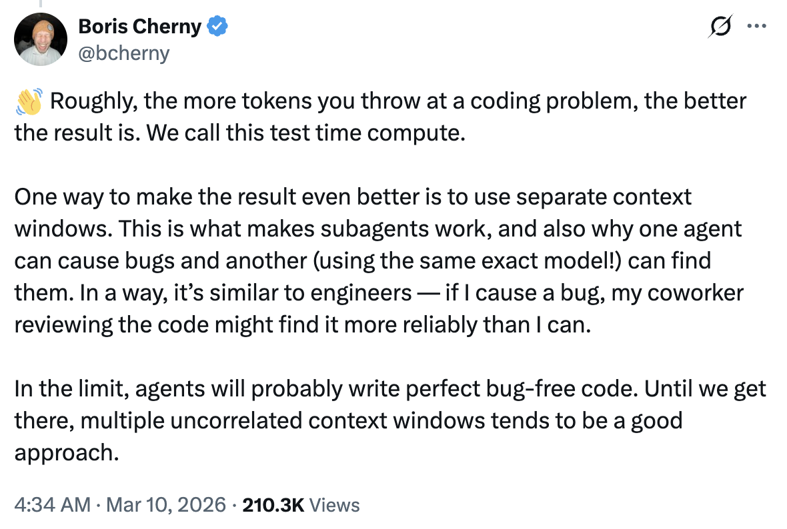

# 代码审查与测试时间计算 — Boris Cherny 的技巧

Boris Cherny（[@bcherny](https://x.com/bcherny)），Claude Code 的 creator，于 2026 年 3 月 10 日分享的见解摘要。

<table width="100%">
<tr>
<td><a href="../">← 返回 Claude Code 最佳实践</a></td>
<td align="right"></td>
</tr>
</table>

---

## 1/ 介绍代码审查

Claude Code 新功能：**代码审查**。一个 agent 团队对每个 PR 进行深入审查。

- 首先为 Anthropic 自己的团队打造 — 今年每位工程师的代码产出提升了 **200%**，而审查曾是瓶颈
- Boris 已经使用了几周，发现它能捕获许多他之前不会注意到的真实 bug
- 当 PR 打开时，Claude 会派遣一个 agent 团队来寻找 bug

---

## 2/ 测试时间计算与多个上下文窗口

粗略来说，你为一个编码问题投入的 token 越多，结果就越好。Boris 称这为 **测试时间计算**。

- 使用 **独立的上下文窗口** 会让结果更好 — 这就是 subagent 能够工作的原因，也是为什么一个 agent 会产生 bug，而另一个（使用完全相同的模型）却能找到它们
- 类似于工程团队：如果 Boris 引入了一个 bug，审查他代码的同事可能比他更可靠地找到它
- 在极限情况下，agent 可能会写出完美的无 bug 代码 — 在那之前，**多个不相关的上下文窗口** 是一个不错的方法

---

## 来源

- [Boris Cherny (@bcherny) 在 X 上 — 2026 年 3 月 10 日](https://x.com/bcherny)