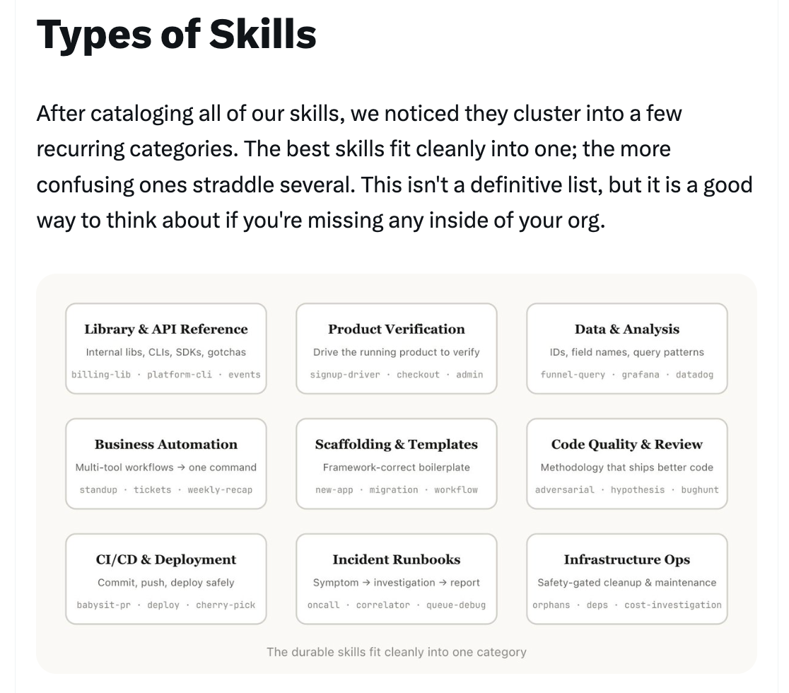
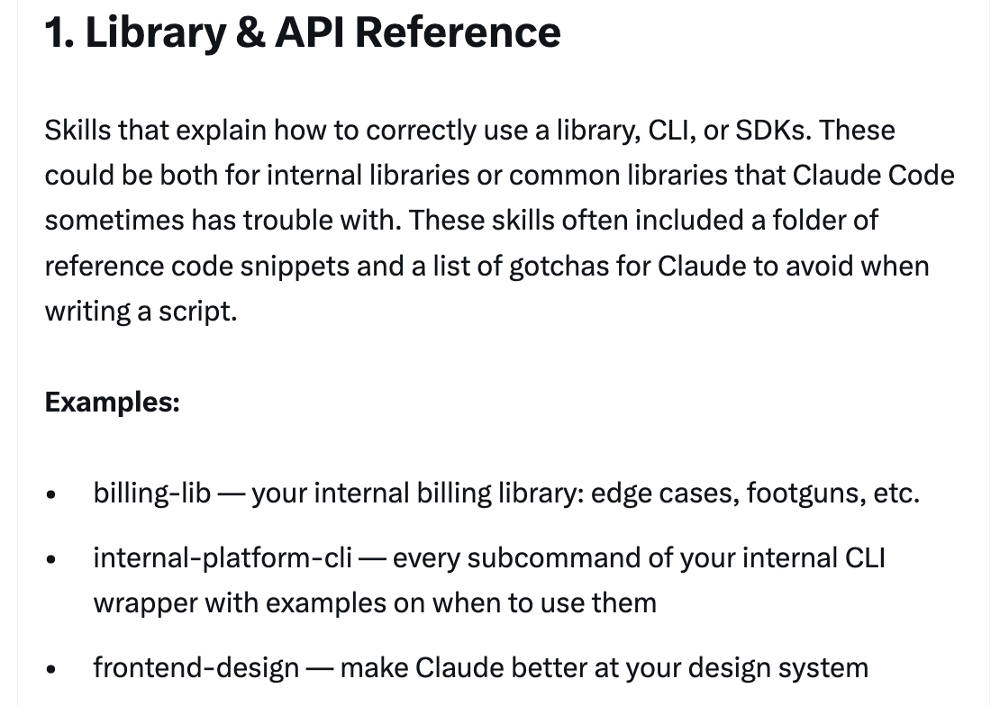
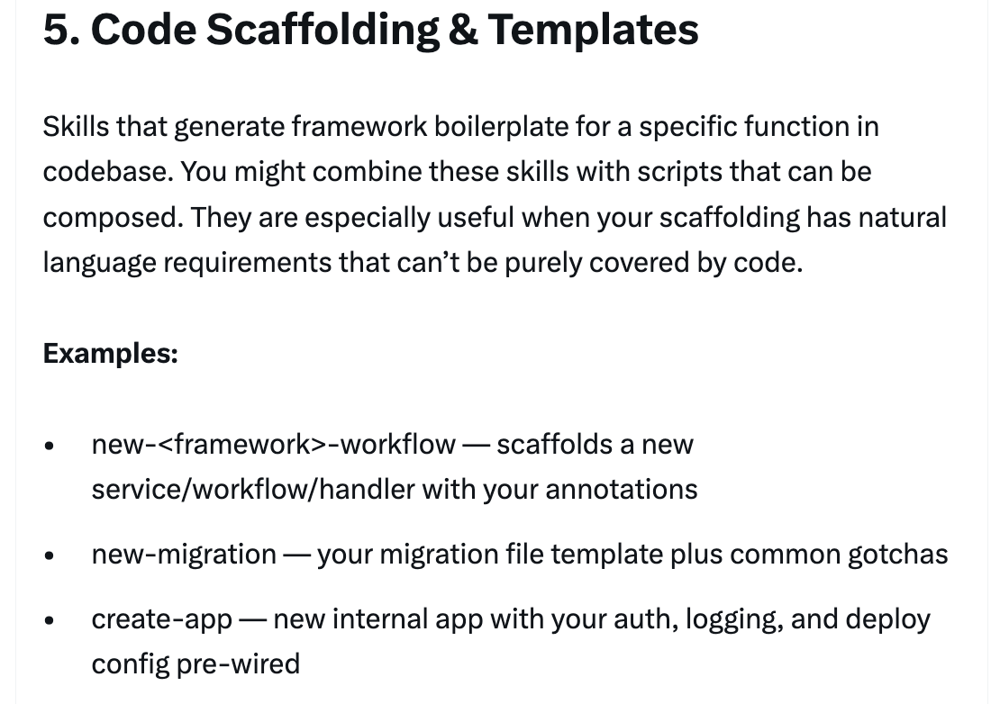
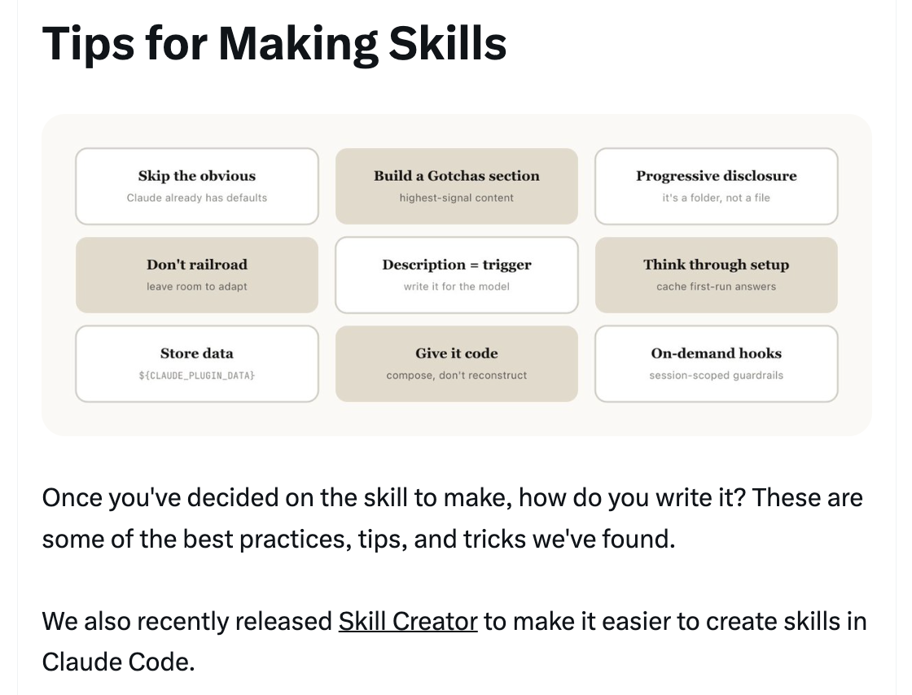
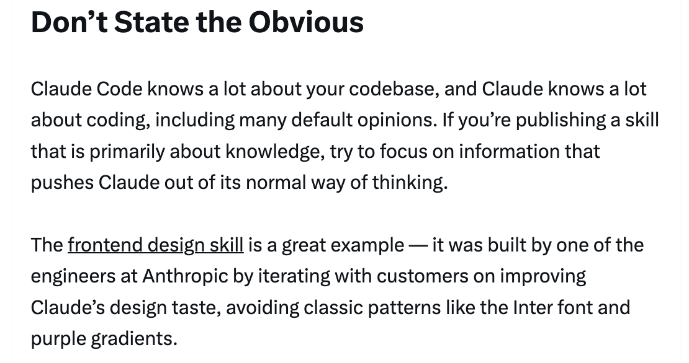
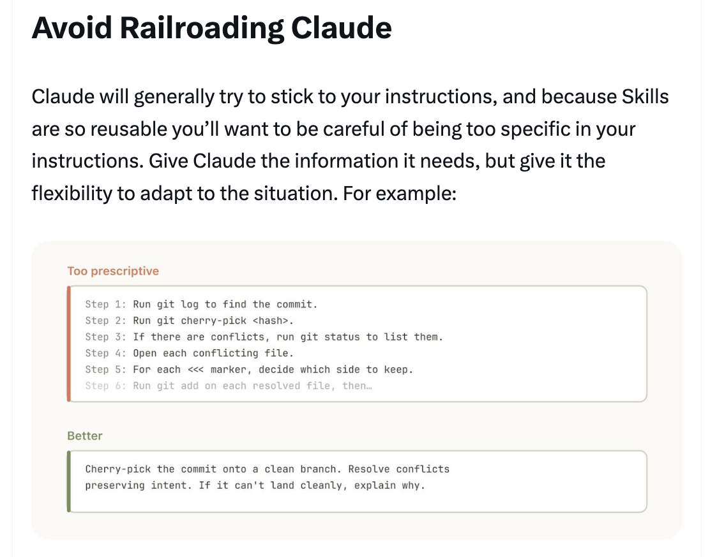
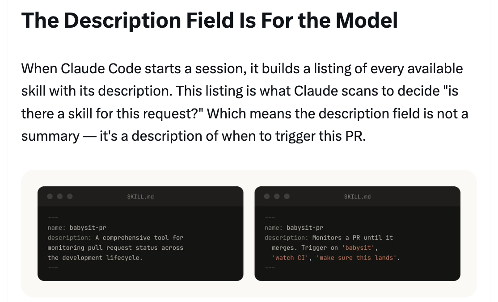
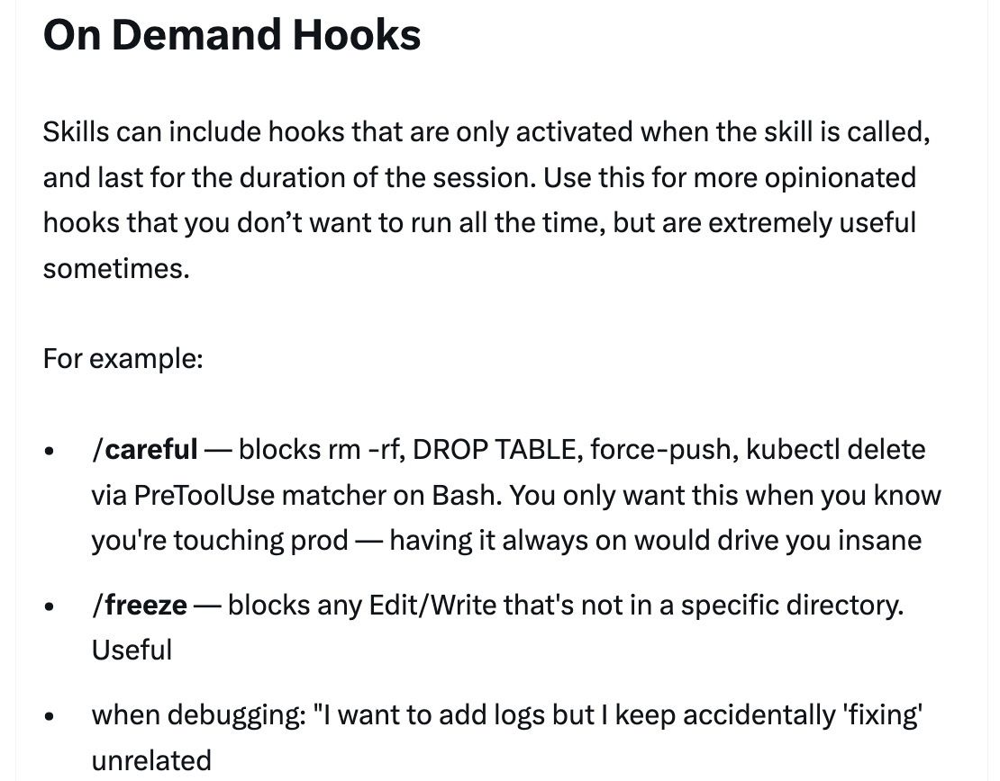

# 构建 Claude Code 的经验：我们如何使用技能 — Thariq

Thariq（[@trq212](https://x.com/trq212)）于 2026 年 3 月 17 日分享的技能内部使用综合指南。

<table width="100%">
<tr>
<td><a href="../">← 返回 Claude Code 最佳实践</a></td>
<td align="right"></td>
</tr>
</table>

---

## 背景

技能已成为 Claude Code 使用最广泛的扩展点之一。它们灵活、易于制作且分发简单。但这种灵活性也使得难以知道什么效果最好。Thariq 分享了在 Anthropic 广泛使用技能的经验教训，目前有数百个技能正在积极使用。

<a href="https://x.com/trq212/status/2033949937936085378"></a

---

## 什么是技能？

一个常见的误解是技能"只是 markdown 文件"，但最有趣的部分是它们是**文件夹**，可以包含脚本、资产、数据等 — agent 可以发现、探索和操作的东西。技能还有广泛的配置选项，包括注册动态 hook。

<a href="https://x.com/trq212/status/2033949937936085378"></a

---

## 技能类型

在整理了所有技能后，团队注意到它们可以分为 9 个常见类别。最好的技能清楚地归入一个；更混淆的技能跨越几个。

<a href="https://x.com/trq212/status/2033949937936085378"></a

---

### 1/ 库和 API 参考

解释如何正确使用库、CLI 或 SDK 的技能。这些可能是内部库或 Claude Code 有时难以处理的常见库。它们通常包括参考代码片段文件夹和编写脚本时要避免的陷阱列表。

**示例：** billing-lib、internal-platform-cli、frontend-design

<a href="https://x.com/trq212/status/2033949937936085378"></a

---

### 2/ 产品验证

描述如何测试或验证你的代码是否正常工作的技能。这些通常与 Playwright、tmux 等外部工具配对。验证技能对于确保 Claude 的输出正确非常有用。让一位工程师花一周时间专门完善你的验证技能可能是值得的。

**示例：** signup-flow-driver、checkout-verifier、tmux-cli-driver

<a href="https://x.com/trq212/status/2033949937936085378"></a

---

### 3/ 数据获取与分析

连接到你的数据和分析堆栈的技能。这些可能包括使用凭证获取数据的库、特定仪表板 ID 等，以及常见工作流或获取数据方式的说明。

**示例：** funnel-query、cohort-compare、grafana

<a href="https://x.com/trq212/status/2033949937936085378"></a

---

### 4/ 业务流程和团队自动化

将重复工作流自动化为一条命令的技能。这些通常是相当简单的说明，但可能对其他技能或 MCP 有更复杂的依赖。将之前的结果保存在日志文件中可以帮助模型保持一致并反思之前的工作流执行。

**示例：** standup-post、create-\<ticket-system\>-ticket、weekly-recap

<a href="https://x.com/trq212/status/2033949937936085378"></a

---

### 5/ 代码脚手架和模板

为代码库中的特定功能生成框架样板文件的技能。你可以将这些技能与可以组合的脚本结合使用。当你的脚手架有无法纯粹用代码覆盖的自然语言需求时，它们特别有用。

**示例：** new-\<framework\>-workflow、new-migration、create-app

<a href="https://x.com/trq212/status/2033949937936085378"></a

---

### 6/ 代码质量和审查

在你的组织内执行代码质量并帮助审查代码的技能。这些可以包括用于最大稳健性的确定性脚本或工具。你可能希望将这些技能作为 hook 的一部分或 inside of a GitHub Action 自动运行。

**示例：** adversarial-review、code-style、testing-practices

<a href="https://x.com/trq212/status/2033949937936085378"></a

---

### 7/ CI/CD 和部署

帮助你在代码库中获取、推送和部署代码的技能。这些技能可能引用其他技能来收集数据。

**示例：** babysit-pr、deploy-\<service\>、cherry-pick-prod

<a href="https://x.com/trq212/status/2033949937936085378">

---

### 8/ 操作手册

接受一个症状（如 Slack 讨论串、警报或错误签名），进行多工具调查，并产生结构化报告的技能。

**示例：** \<service\>-debugging、oncall-runner、log-correlator

<a href="https://x.com/trq212/status/2033949937936085378"></a

---

### 9/ 基础设施运维

执行常规维护和操作程序的技能 — 其中一些涉及可能受益于保护措施的危害性操作。这些使得工程师更容易在关键操作中遵循最佳实践。

**示例：** \<resource\>-orphans、dependency-management、cost-investigation

<a href="https://x.com/trq212/status/2033949937936085378"></a

---

## 制作技能的技巧

编写有效技能的 9 个最佳实践，加上分发和衡量的指导。

<a href="https://x.com/trq212/status/2033949937936085378"></a

---

### 技巧 1：不要陈述显而易见的事情

Claude Code 对你的代码库了解很多，Claude 对编码也有很多了解，包括许多默认观点。如果你发布的技能主要是关于知识的，试着聚焦于推动 Claude 走出其正常思维方式的信息。前端设计技能就是一个很好的例子 — 它是通过与客户迭代改进 Claude 的设计品味而构建的，避免了经典的模式，如 Inter 字体和紫色渐变。

<a href="https://x.com/trq212/status/2033949937936085378"></a

---

### 技巧 2：构建陷阱部分

任何技能中最高信号的内容是陷阱部分。这些部分应该从 Claude 使用你的技能时遇到的常见失败点建立起来。理想情况下，随着时间的推移，你会更新你的技能来捕获这些陷阱。

<a href="https://x.com/trq212/status/2033949937936085378"></a

---

### 技巧 3：使用文件系统与渐进式披露

技能是一个文件夹，而不仅仅是 markdown 文件。你应该将整个文件系统视为一种上下文工程和渐进式披露形式。告诉 Claude 你的技能中有哪些文件，它会在适当的时候读取它们。最简单的形式是指向其他 markdown 文件 — 例如，将详细的函数签名和使用示例拆分到 `references/api.md`。你可以有参考、脚本、示例等的文件夹。

<a href="https://x.com/trq212/status/2033949937936085378"></a

---

### 技巧 4：避免把 Claude 推向轨道

Claude 通常会尽力坚持你的指令，而且因为技能如此可重用，你要小心不要过于具体。给 Claude 它需要的信息，但给它适应情况的灵活性。与其给出规定性的逐步说明，不如给出目标和约束。

<a href="https://x.com/trq212/status/2033949937936085378"></a

---

### 技巧 5：考虑设置

有些技能可能需要从用户那里设置上下文。一个好的模式是将此设置信息存储在技能目录中的 `config.json` 文件中。如果配置未设置，agent 可以向用户询问信息。你可以指示 Claude 使用 AskUserQuestion 工具进行结构化的多项选择问题。

<a href="https://x.com/trq212/status/2033949937936085378"></a

---

### 技巧 6：描述字段是为模型准备的

当 Claude Code 启动一个会话时，它会构建每个可用技能及其描述的列表。这个列表是 Claude 扫描以决定"这个请求有对应的技能吗？"的内容。这意味着描述字段不是总结 — 它是关于**何时触发**这个技能的描述。为模型编写它。

<a href="https://x.com/trq212/status/2033949937936085378"></a

---

### 技巧 7：记忆和存储数据

有些技能可以通过在它们内部存储数据来包含一种记忆形式。你可以将数据存储在像追加日志文件或 JSON 文件一样简单的东西中，或者像 SQLite 数据库一样复杂的东西中。存储在技能目录中的数据可能在你升级技能时被删除，所以使用 `${CLAUDE_PLUGIN_DATA}` 作为每个插件的稳定文件夹来存储数据。

<a href="https://x.com/trq212/status/2033949937936085378"></a

---

### 技巧 8：存储脚本和生成代码

你可以给 Claude 的最强大的工具之一是代码。给 Claude 脚本和库让 Claude 把它的回合花在组合上，决定下一步做什么，而不是重建样板文件。然后 Claude 可以即时生成脚本，将这些功能组合起来进行更高级的分析。

<a href="https://x.com/trq212/status/2033949937936085378"></a

---

### 技巧 9：按需 Hook

技能可以包含仅在调用技能时激活的 hook，持续整个会话。对于那些你不想一直运行但有时非常有用的更固执己见的 hook，请使用此功能。

**示例：**
- `/careful` — 通过 Bash 上的 PreToolUse matcher 阻止 rm -rf、DROP TABLE、force-push、kubectl delete
- `/freeze` — 阻止任何不在特定目录中的 Edit/Write

<a href="https://x.com/trq212/status/2033949937936085378"></a

---

## 分发技能

与你的团队分享技能的两种方式：
- **检入你的仓库**（在 `.claude/skills` 下）— 适用于在相对较少的仓库中工作的小团队
- **制作一个插件** 并让用户可以上传和安装插件的 Claude Code Plugin 市场

每个检入的技能也会为模型的上下文增加一点。随着你的规模扩大，内部插件市场允许你分发技能并让你的团队决定安装哪些。

<a href="https://x.com/trq212/status/2033949937936085378"></a

---

## 管理市场

没有一个集中团队决定哪些技能进入市场。相反，尝试有机地找到最有用的技能。上传到 GitHub 的沙盒文件夹并在 Slack 或其他论坛中指向人们。一旦一个技能获得了牵引力（由技能所有者决定），他们可以提交 PR 将其移到市场。发布前的筛选很重要，以避免重复的技能。

<a href="https://x.com/trq212/status/2033949937936085378"></a

---

## 组合技能

你可能希望让技能相互依赖。例如，一个文件上传技能上传文件，一个 CSV 生成技能生成 CSV 并上传它。这种依赖管理目前不是市场或技能原生内置的，但你可以通过名称引用其他技能，如果它们已安装，模型将调用它们。

<a href="https://x.com/trq212/status/2033949937936085378"></a

---

## 衡量技能

要了解一个技能的表现如何，使用 PreToolUse hook 让你在公司内记录技能使用情况。这意味着你可以找到受欢迎的技能或与预期相比触发不足的技能。

<a href="https://x.com/trq212/status/2033949937936085378"></a

---

## 结论

技能是 agent 非常强大、灵活的工具，但仍处于早期阶段，我们都在弄清楚如何最好地使用它们。与其将其视为权威指南，不如将其视为我们看到有效的有用技巧的集合。理解技能的最好方式是开始、实验并看看什么适合你。我们的多数技能始于几行和一个单一的陷阱，并因为人们在 Claude 遇到新边缘情况时不断添加而变得更好。

<a href="https://x.com/trq212/status/2033949937936085378"></a

---

## 来源

- [Thariq (@trq212) 在 X 上 — 2026 年 3 月 17 日](https://x.com/trq212/status/2033949937936085378)
- [Skilljar — Agent Skills 课程](https://code.claude.com/docs/en/skills)
- [Skill Creator](https://code.claude.com/docs/en/skills)